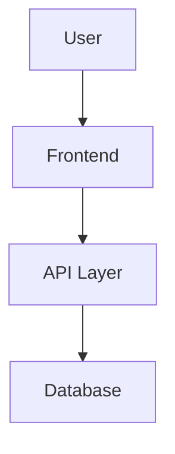

# README Template

## Project Name
*Short, catch description of the project.*

## Value Proposition
*Explain what problem this project solves and why it matters.*

## Tech Stack
*List the core technologies used.*
- **Frontend**: [e.g. Next.js, React, Tailwind]
- **Backend**: [e.g. Node.js, Prisma, PostgreSQL]
- **AI Agent Integration**: [e.g. Antigravity Skill, n8n]
- **Infrastructure**: [e.g. Vercel, Docker]

## Quick Start
*Installation and setup instructions.*
```bash
git clone <repository-url>
cd <project-folder>
npm install
npm run dev
```

## Project Structure
*High-level overview of the most important folders and files.*
- `src/`: Main application code.
- `public/`: Assets and public files.
- `.agent/`: Workflows and agent-related configurations.

## Architecture
*High-level description or Mermaid diagram of the system.*


## Contributing
*Brief mention of contributing guidelines, pointing to CONTRIBUTING.md.*

---
*Generated by Documentation Expert Skill*
